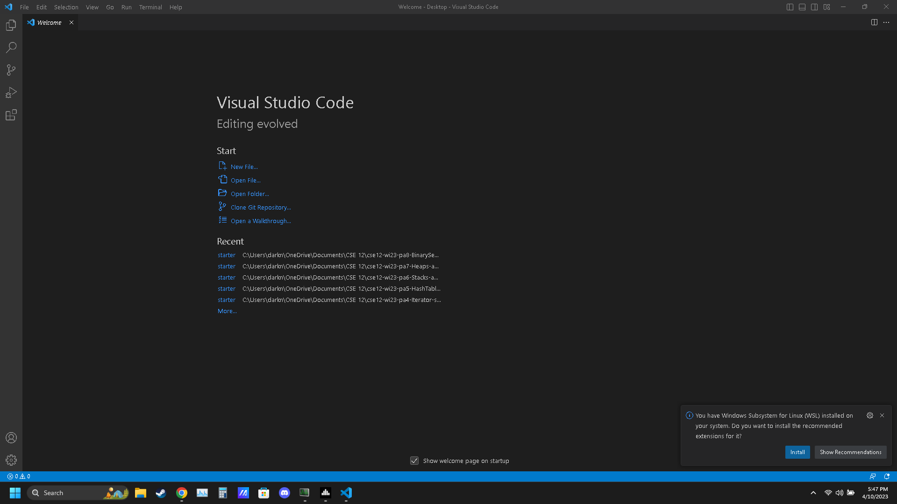
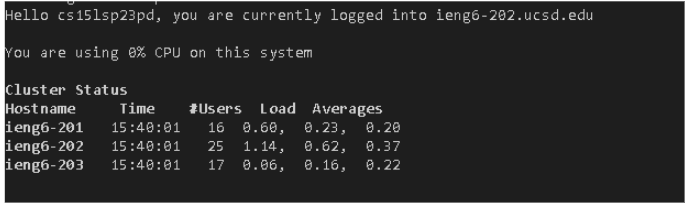
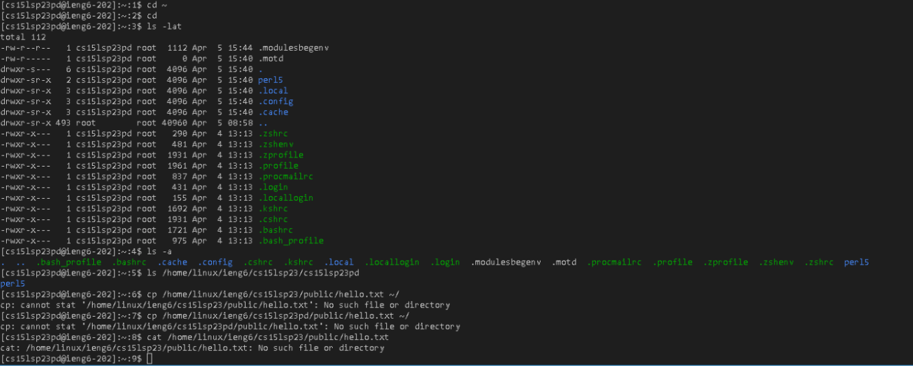

# Lab 1 report
1. Installing visual code
- If you don't want to installed visual code, use the lab computer. If you also had Visual code installed on your laptop, you can skipped this step.
- Second, follow this website instruction [website1](https://code.visualstudio.com/).
- it should look something like this or similar to it when you finish.

2. Remotely Connecting
- Look for your cse15L account at [website2](https://sdacs.ucsd.edu/~icc/index.php).
- add bash to your visual code, follow this step if you don't know how [website3](https://stackoverflow.com/questions/42606837/how-do-i-use-bash-on-windows-from-the-visual-studio-code-integrated-terminal/50527994#50527994).
- now using bash and this commandline  
```
# code block
ssh cs15lsp23zz@ieng6.ucsd.edu
```
- (replace the cs15lsp23zz with your cse15L account), you will be able to login into ieng6. Fyi, the password is invisible when you type your password, and to reset password you go to your cse15L account at step website2.
- should look something like, when you login in.

3. Trying some command
-  Now you will try out command like cd, ls, pwd, mkdir, and cp.
-   ls shows the directory you can go to in the directory you picked, cd is the current directory,  pwd print the current directory, mkdir create a directory, and Cp is copy file.
- What I had try with the commands was ls -lat, ls -a, ls /home/linux/ieng6/cs15lsp23/cs15lsp23abc, cd, cd ~, and few other things
-  Cd change nothing, since Im at the homescreen and ls show things on the device.
Here was my result

end
The website I used is [geeksforgeek](https://www.geeksforgeeks.org/find-command-in-linux-with-examples/)
