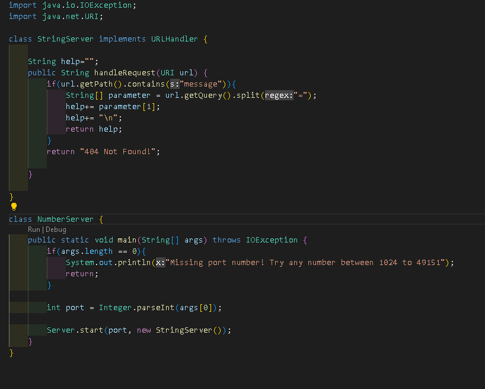
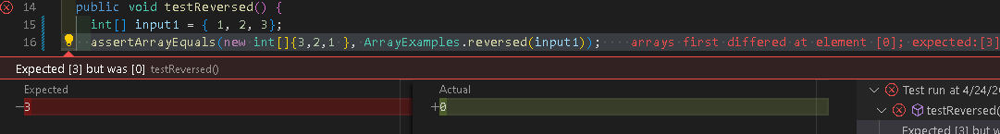
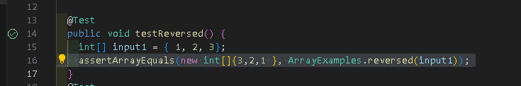

# lab 2
## Part 1
- The method is pretty similar to NumberServer


- handleRequest(in the Stringserver class) and the main method(in the number server class) is the method that's being called.
handlerequest and main method method
```
  # code block
  handlerequest method
  public String handleRequest(URI url) {
        if(url.getPath().contains("message")){
            String[] parameter = url.getQuery().split("=");
            help+= parameter[1];
            help+= "\n";
            return help;
        }
        return "404 Not Found!";
        
    }
    
  mian method
  public static void main(String[] args) throws IOException {
        if(args.length == 0){
            System.out.println("Missing port number! Try any number between 1024 to 49151");
            return;
        }

        int port = Integer.parseInt(args[0]);

        Server.start(port, new StringServer());
    }
```
- In this specific case, the handlerequest method, the argument is "url" and the value of "url" is URL. While, the main method has the argument of "args" and the value of String[]
- The value doesn't change because we need to use the url to get the paths and query.
- if you do use different value then it will most likely give you an error, like "Missing port number! Try any number between 1024 to 49151" or another error.


- handleRequest is the method that's being called.
- The argument is URL url and the value being URL
- The value doesn't change because it's using the same method as the above image. 
## Part 2
I chosed the testreversesd bug in lab 3
- the failure induce code
```
  # code block
  
        arr[i] = newArray[arr.length - i - 1];
    }
    return arr;
    
```
- the correct code
 ```
  # code block
  
        newArray[i] = arr[arr.length - i - 1];
    }
    return newArray;
```


- the error that the failure gave.
- what the error mean that the code wasn't giving what you were expecting


- the correct that the correct code gave
- This mean that the code give you the answer that you were expecting.
- When it ran, it didn't show the red box or any error, like the above image. 
- It should've a green check mark on the side.



- the code block for error and correct code. 
- The failure-induce and correct-induce result of the code is the two images above.
- The error code was the first image(the error one) above, while the correct code was the second image(the correct one) above.
```
  # code block
  THE ERROR CODE
   static int[] reversed(int[] arr) {
    int[] newArray = new int[arr.length];
    for(int i = 0; i < arr.length; i += 1) {
      arr[i] = newArray[arr.length - i - 1];
    }
    return arr;
  }
  
  
    THE CORRECT CODE
     static int[] reversed(int[] arr) {
    int[] newArray = new int[arr.length];
    for(int i = 0; i < arr.length; i += 1) {
      newArray[i] = arr[arr.length - i - 1];
    }
       return newArray;
  }
```
- this fix the issues because before the code were changing the current array and not the new one that you need to change, which cause the output to be 0.
- Now with the correct way, the code are changing the new Array with the current array, which will give out the correct output.
## Part 3
- What I learned from week 2 that I didn't knew before was using the server and the url, such as manipulate the url to get the output like adding and increment. What I learned from week 3 was creating a StringServer by using my past experience with the NumberServer from week 2. The new thing was making the url get the pathway instead of the querey. The hardest part of making the string server was making the String appear onto the localhost page and storing the string.
