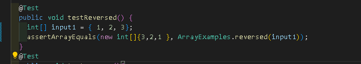

# lab 2
## Part 1
- The method is pretty similar to NumberServer


- handleRequest is the method that's being called.
- The argument is URL url and the value being URL
- The value doesn't change because we need to use the url to get the paths and query.


- handleRequest is the method that's being called.
- The argument is URL url and the value being URL
- The value doesn't change because it's using the same method as the above image.
## Part 2
I chosed the testreversesd bug in lab 3
- the failure induce code
```
  # code block
  
        arr[i] = newArray[arr.length - i - 1];
    }
    return arr;
    
```
- the correct code
 ```
  # code block
  
        newArray[i] = arr[arr.length - i - 1];
    }
    return newArray;
```
- the error that the failure gave


- the correct that the correct code gave



- the code block for error and correct code.
```
  # code block
  THE ERROR CODE
   static int[] reversed(int[] arr) {
    int[] newArray = new int[arr.length];
    for(int i = 0; i < arr.length; i += 1) {
      arr[i] = newArray[arr.length - i - 1];
    }
    return arr;
  }
  
  
    THE CORRECT CODE
     static int[] reversed(int[] arr) {
    int[] newArray = new int[arr.length];
    for(int i = 0; i < arr.length; i += 1) {
      newArray[i] = arr[arr.length - i - 1];
    }
       return newArray;
  }
```
- this fix the issues because before the code were changing the current array and not the new one that you need to change, which cause the output to be 0.
- Now with the correct way, the code are changing the new Array with the current array, which will give out the correct output.
## Part 3
- What I learned from week 2 that I didn't knew before was using the server and the url, such as manipulate the url to get the output like adding and increment. What I learned from week 3 was creating a StringServer by using my past experience with the NumberServer from week 2. The new thing was making the url get the pathway instead of the querey. The hardest part of making the string server was making the String appear onto the localhost page and storing the string.
