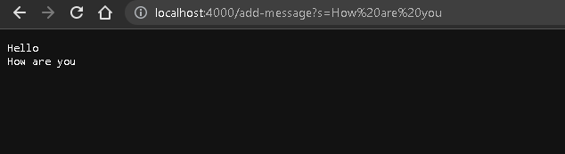

# lab 2
## Part 1
- The method is pretty similar to NumberServer

- handleRequest is the method that's being called.
- The argument is URL url and the value being URL
- The value doesn't change because we need to use the url to get the paths and query.

- handleRequest is the method that's being called.
- The argument is URL url and the value being URL
- The value doesn't change because it's using the same method as the above image.
## Part 2
- 2
- 2
- 2
## Part 3
- 2
- 2
- 2
