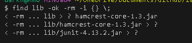

# lab 3
## Part 1
- The command that I research is the Find.
- What I found interesting is -exec CMD for Find. The reason is that it shows if the command is sucessful by returning 0
- 
- Another rone I found useful is -empty. The reason is that it found empty file, which you can use to delete and have some file management.
- Also, show unused file.
- 
- Another cmd I found interesting is -print becausse it shows all the pathway of the file, which can be useful to get the pathway.
- 
- what another thing I found interesting is -links. The reason why I found it interesting because you can find file that contain a character
- 
