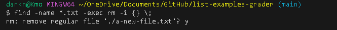
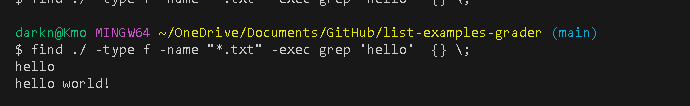
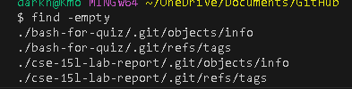
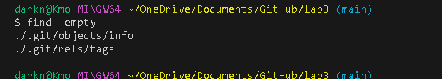
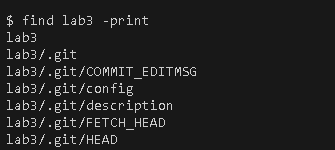
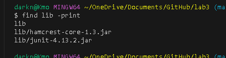
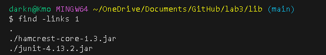
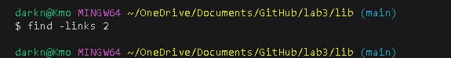

# lab 3
## Part 1
The website I used is [geeksforgeek](https://www.geeksforgeeks.org/find-command-in-linux-with-examples/) 

(The link is clickable on github page and on pdf, but it's not clickable on gradescope and I don't know how to fix that, so here's the url https://www.geeksforgeeks.org/find-command-in-linux-with-examples/ )

I found all the method at the geeksforgeeks. 
- The command that I research is the Find.
- What I found interesting is -exec CMD for Find. The reason is that it shows if the command is sucessful by returning 0. Got the command from the greeksforgeek
- 

-
- Another rone I found useful is -empty. The reason is that it found empty file, which you can use to delete and have some file management.
- Also, show unused file.
- 
- 
- Another cmd I found interesting is -print becausse it shows all the pathway of the file, which can be useful to get the pathway.
- 
- 
- what another thing I found interesting is -links. The reason why I found it interesting because you can find file that contain a character
- 
- The next picture shows what happen if they can't find anything.
- 

