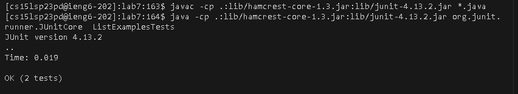
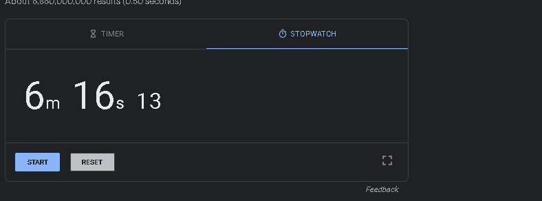

# Lab 4

Every space between an character is a key press.

## login into the ieng6 account:

s h h c s 1 5 l s p 2 3 p d @ i e n g 6 . u c s d . e d u \<enter> 
  
  
## clone lab 7 and change directory:
  
  
g i t c l o n e h t t p s : / / g i t h u b . c o m / u c s d - c s e 1 5 l - s 2 3 / l a b 7 \<enter>
  
  
c d l a b 7
  
  
  
## Test if the code work correctly by complie junit and core, and running them:
compile the code:

j a v a c * . j a v a \<enter>  
  
complie junit and core:

j  a v a c - c p . : l i b / h a m c r e s t - c o r e - 1 . 3 . j a r : l i b / j u n i t - 4 . 1 3 . 2 . j a r * . j a v a \<enter>
  
run junit and core:

j a v a   - c p  . : l i b / h a m c r e s t - c o r e - 1 . 3 . j a r : l i b / j u n i t - 4 . 1 3 . 2 . j a r o r g . j u n i t . r u n n e r . J U n i t C o r e L i s t   E x a m p l e s T e s t s \<enter>
  
  
## The  error:
  

## editing the java via vim:

 v i m  L i s t E x a m p l e s . j a v a \<enter>\<esc>
 
 ## editing the  code:
 
 search:
 / w h i l e ( i n d e x 2 \<enter>
 
 
 move to the word:
 
 
 \<down>\<down>\<down>
 
 
 \<right>\<right>
 
 
 delete the word:
 
 
 c w
 
 add the word:
 
 
 i n d e x 2 \<esc> 
 
 save the file:
 
 : w  q \<enter>

## the success

# timer

