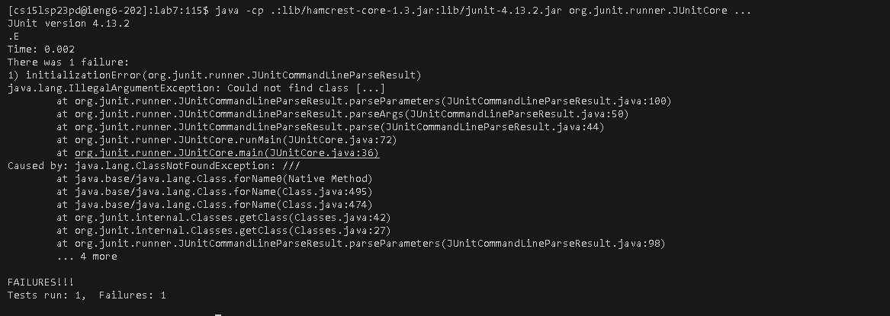

# Lab 4
login into the account:
s h h c s 1 5 l s p 2 3 p d @ i e n g 6 . u c s d . e d u <enter> (log into my ieng6 account)
clone:
g i t c l o n e h t t p s : / / g i t h u b . c o m / u c s d - c s e 1 5 l - s 2 3 / l a b 7<enter> (git clone [lab 7](https://github.com/ucsd-cse15l-s23/lab7))
c d l a b 7(change the directory to lab7)
Test if it work correctly:
j  a v a c - c p . : l i b / h a m c r e s t - c o r e - 1 . 3 . j a r : l i b / j u n i t - 4 . 1 3 . 2 . j a r * . j a v a (javac the junit and the core)
j a v a   - c p  . : l i b / h a m c r e s t - c o r e - 1 . 3 . j a r : l i b / j u n i t - 4 . 1 3 . 2 . j a r o r g . j u n i t . r u n n e r . J U n i t C o r e . . . (java the junit and the core)

  
