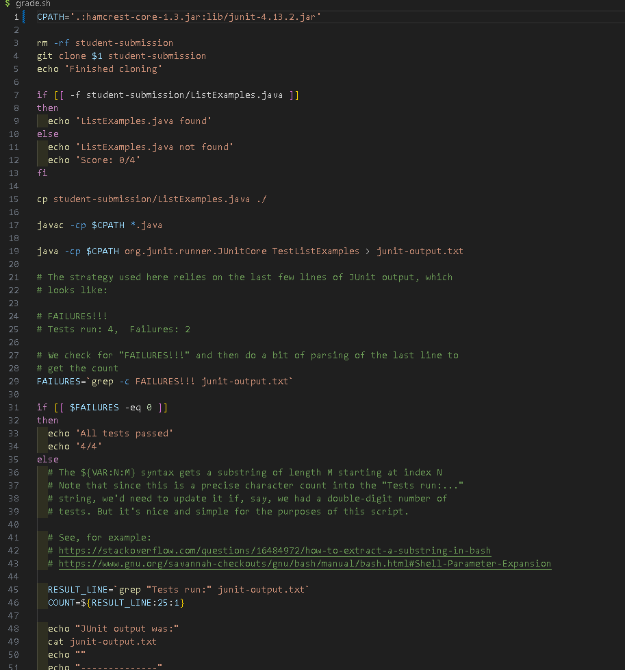
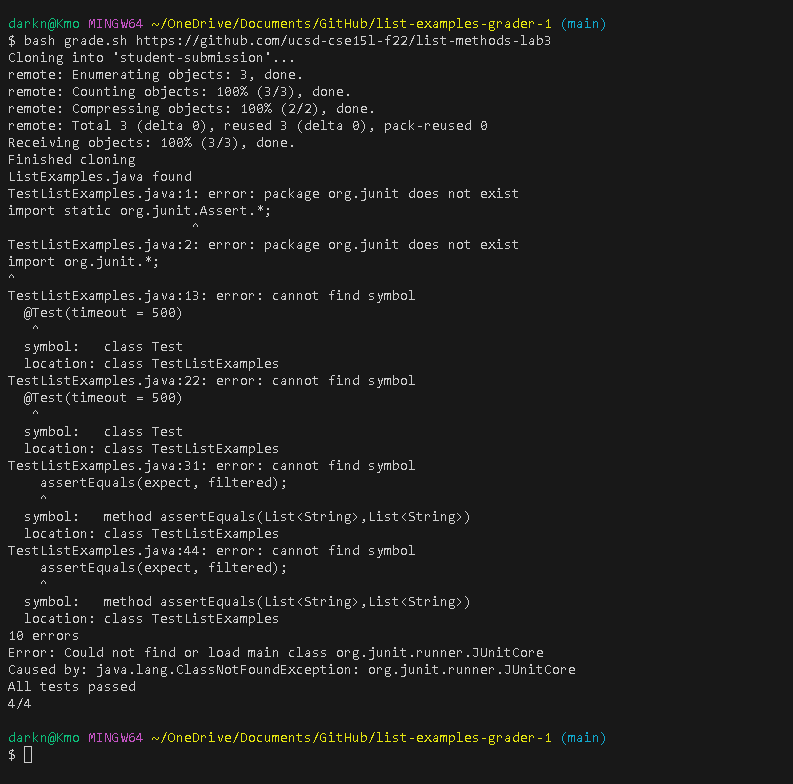
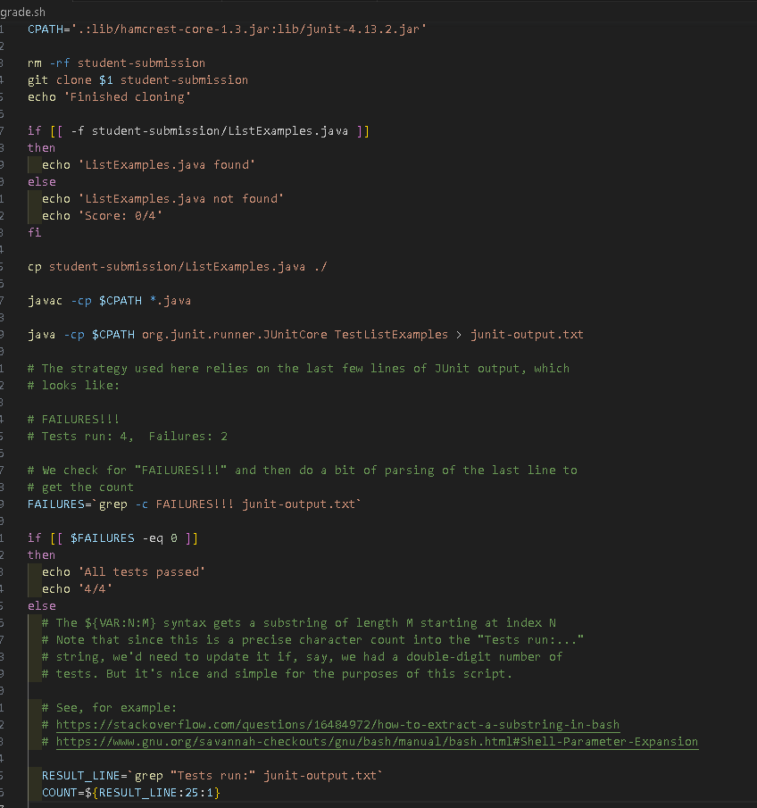
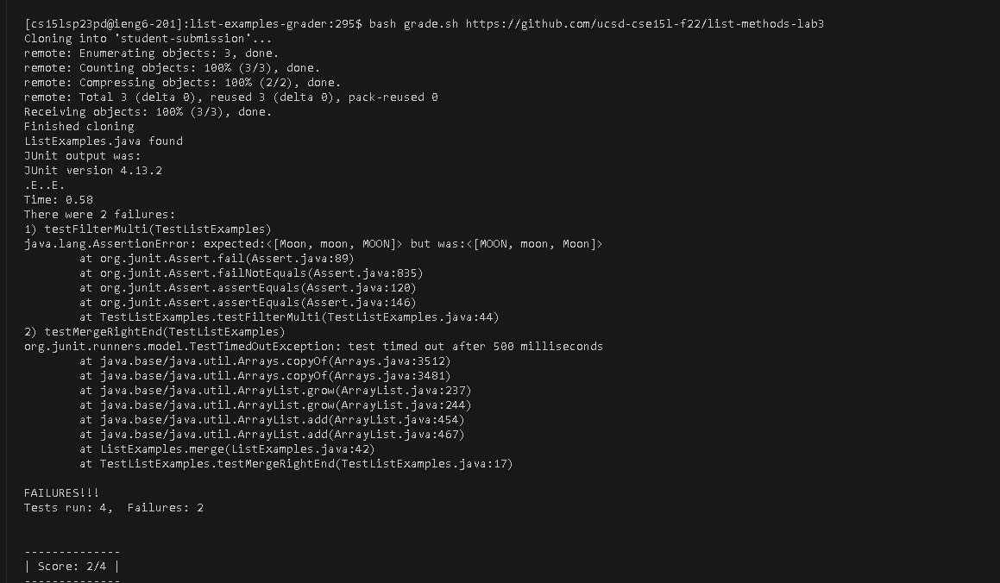

# lab 5

## Student's Response

What environment are you using (computer, operating system, web browser, terminal/editor, and so on)?

  -The environment I'm using is visual studio code with an computer.

Detail the symptom you're seeing. Be specific; include both what you're seeing and what you expected to see instead. Screenshots are great, copy-pasted terminal output is also great. Avoid saying “it doesn't work”.

  -My grade.sh seem to has a bug.
  
  
  Here's the orginal code

  
  
  
  here's the error
  
  
  
  
Detail the failure-inducing input and context. That might mean any or all of the command you're running, a test case, command-line arguments, working directory, even the last few commands you ran. Do your best to provide as much context as you can.

I think the failure induce input is coming from my grade.sh. The junit isn't working for the TestListExamples.java. The error: java.lang.ClassNotFoundException: org.junit.runner.JUnitCore.

## TA's Response

You're correct that the error is in the grade.sh. You should check the pathway for the junits.

## Students's Responses

I had fixed the pathway, but I still get an error

Code:

Error:

